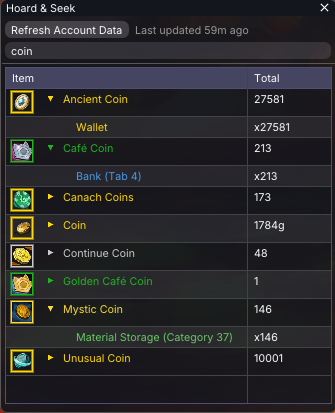
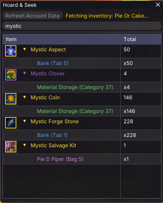

# Hoard & Seek

A Guild Wars 2 addon for [Raidcore Nexus](https://raidcore.gg/Nexus) that lets you search for items across your entire account — bank, material storage, shared inventory, character bags, and equipped gear.

## AI Notice

This addon has been 100% created in [Windsurf](https://windsurf.com/) using Claude. I understand that some folks have a moral, financial or political objection to creating software using an LLM. I just wanted to make a useful tool for the GW2 community, and this was the only way I could do it.

If an LLM creating software upsets you, then perhaps this repo isn't for you. Move on, and enjoy your day.

## Features

- **Account-wide item search** — type an item name and instantly see where it is
- **Location tracking** — shows exact location: bank tab, material storage, character name + bag number, equipped slot, shared inventory, guild stash, or TP delivery box
- **Wallet & currency search** — search wallet currencies alongside items
- **Persistent cache** — account data is saved locally so searches work across game sessions
- **Cross-addon API** — other addons can query item counts, wallet balances, achievements, masteries, skin/recipe unlocks, and Wizard's Vault progress via Nexus events
- **Permission system** — users control which addons can access their account data

## Screenshots





<details>
<summary><h2>GW2 API Endpoints Used</h2></summary>

| Endpoint | Purpose |
|---|---|
| `/v2/account/materials` | Material storage contents |
| `/v2/account/bank` | Bank vault contents (with tab tracking) |
| `/v2/account/inventory` | Shared inventory slots |
| `/v2/characters` | Character list |
| `/v2/characters/:name/inventory` | Character bag contents |
| `/v2/characters/:name/equipment` | Equipped gear per character |
| `/v2/account/legendaryarmory` | Legendary armory contents |
| `/v2/account` | Account name, guild IDs |
| `/v2/guild/:id` | Guild name |
| `/v2/guild/:id/stash` | Guild bank contents (per tab) |
| `/v2/commerce/delivery` | Trading Post delivery box |
| `/v2/account/wallet` | Wallet currency balances |
| `/v2/currencies?ids=...` | Currency names and details |
| `/v2/items?ids=...` | Item names, icons, rarity, type |
| `/v2/tokeninfo` | API key validation |
| `/v2/account/achievements?ids=...` | Achievement progress (proxy query) |
| `/v2/account/masteries` | Mastery levels (proxy query) |
| `/v2/account/skins` | Skin unlock status (proxy query) |
| `/v2/account/recipes` | Recipe unlock status (proxy query) |
| `/v2/account/wizardsvault/daily` | Wizard's Vault daily objectives (proxy query) |
| `/v2/account/wizardsvault/weekly` | Wizard's Vault weekly objectives (proxy query) |
| `/v2/account/wizardsvault/special` | Wizard's Vault special objectives (proxy query) |

### Required API Key Permissions

- `account`
- `inventories`
- `characters`
- `unlocks`
- `guilds` (optional — enables guild stash search)
- `tradingpost` (optional — enables TP delivery box search)
- `progression` (optional — enables Wizard's Vault proxy queries)

</details>

## Building

### Prerequisites

- CMake 3.20+
- MinGW cross-compiler (`x86_64-w64-mingw32-gcc`, `x86_64-w64-mingw32-g++`)

### Setup

Download dependencies (ImGui and nlohmann/json):

```bash
chmod +x scripts/setup.sh
./scripts/setup.sh
```

### Build

```bash
mkdir build && cd build
cmake ..
make
```

This produces `HoardAndSeek.dll`.

## Installation

1. Install [Raidcore Nexus](https://raidcore.gg/Nexus) for Guild Wars 2
2. Copy `HoardAndSeek.dll` to your Nexus addons directory
3. Launch GW2 — toggle the search window with `Ctrl+Shift+F` or click the icon in the Quick Access toolbar

## Usage

1. Open Nexus addon settings and paste your GW2 API key (create one at [account.arena.net](https://account.arena.net/applications))
2. Click **Save Key** — the key will be validated automatically
3. Open the Hoard & Seek window (`Ctrl+Shift+F`)
4. Click **Refresh Account Data** to fetch all account data
5. Type at least 3 characters in the search box to find items

<details>
<summary><h2>Cross-Addon API</h2></summary>

Hoard & Seek exposes a Nexus event-based API so other addons can query account data without their own GW2 API integration. No link-time dependency is required — just include `HoardAndSeekAPI.h` in your addon.

### Setup

Copy `include/HoardAndSeekAPI.h` into your addon's include path. All communication uses Nexus `Events_Raise` / `Events_Subscribe`.

### Events

#### Broadcasts (raised by Hoard & Seek)

| Event | Payload | Description |
|---|---|---|
| `EV_HOARD_DATA_UPDATED` | `HoardDataReadyPayload*` | Raised when account data finishes loading (startup cache or refresh) |
| `EV_HOARD_FETCH_PROGRESS` | `HoardFetchProgressPayload*` | Raised during an account data fetch with a status message (e.g. "Fetching bank...", "Fetching inventory: Character...") |
| `EV_HOARD_FETCH_ERROR` | `HoardFetchErrorPayload*` | Raised when a fetch fails (API offline, network error, invalid key, etc.) |
| `EV_HOARD_PONG` | `HoardPongPayload*` | Raised in response to `EV_HOARD_PING` — confirms H&S is loaded, includes `last_updated`, `refresh_available_at`, and `has_data` |

Subscribe to `EV_HOARD_DATA_UPDATED` to know when H&S has data available for queries. Subscribe to `EV_HOARD_FETCH_PROGRESS` to show live progress in your addon's UI. Subscribe to `EV_HOARD_FETCH_ERROR` to detect and display fetch failures (e.g. GW2 API maintenance).

#### Requests (raised by your addon)

| Event | Request Payload | Response Payload | Description |
|---|---|---|---|
| `EV_HOARD_PING` | `nullptr` | `EV_HOARD_PONG` | Checks if H&S is loaded. If it is, H&S immediately responds with `EV_HOARD_PONG`. |
| `EV_HOARD_REFRESH` | `nullptr` | *(none — triggers refresh)* | Triggers an account data refresh in H&S (same as pressing the button). H&S broadcasts `EV_HOARD_DATA_UPDATED` on completion. |
| `EV_HOARD_SEARCH` | `const char*` | *(none — opens H&S UI)* | Opens the H&S window and searches for the given item name |
| `EV_HOARD_QUERY_ITEM` | `HoardQueryItemRequest*` | `HoardQueryItemResponse*` | Returns total count and up to 32 locations for a specific item ID |
| `EV_HOARD_QUERY_WALLET` | `HoardQueryWalletRequest*` | `HoardQueryWalletResponse*` | Returns wallet currency balance for a specific currency ID |
| `EV_HOARD_QUERY_ACHIEVEMENT` | `HoardQueryAchievementRequest*` | `HoardQueryAchievementResponse*` | Proxy query: fetches account achievement progress from the GW2 API (batch, up to 200 IDs) |
| `EV_HOARD_QUERY_MASTERY` | `HoardQueryMasteryRequest*` | `HoardQueryMasteryResponse*` | Proxy query: fetches account mastery levels from the GW2 API (batch, up to 200 IDs) |
| `EV_HOARD_QUERY_SKINS` | `HoardQuerySkinsRequest*` | `HoardQuerySkinsResponse*` | Proxy query: checks if specific skin IDs are unlocked (batch, up to 200 IDs) |
| `EV_HOARD_QUERY_RECIPES` | `HoardQueryRecipesRequest*` | `HoardQueryRecipesResponse*` | Proxy query: checks if specific recipe IDs are unlocked (batch, up to 200 IDs) |
| `EV_HOARD_QUERY_WIZARDSVAULT` | `HoardQueryWizardsVaultRequest*` | `HoardQueryWizardsVaultResponse*` | Proxy query: fetches Wizard's Vault objectives and progress (type: 0=daily, 1=weekly, 2=special) |

### Request / Response Pattern

For query events, you provide a `response_event` name in the request struct. H&S processes the query, then raises that named event with a heap-allocated response payload. **The caller is responsible for freeing the response with `delete`.**

`EV_HOARD_QUERY_ITEM` and `EV_HOARD_QUERY_WALLET` return cached data (fast, synchronous-feeling). `EV_HOARD_QUERY_ACHIEVEMENT`, `EV_HOARD_QUERY_MASTERY`, `EV_HOARD_QUERY_SKINS`, `EV_HOARD_QUERY_RECIPES`, and `EV_HOARD_QUERY_WIZARDSVAULT` are **proxy queries** that make a live API call using H&S's stored API key, so the response is asynchronous with network latency.

`HoardDataReadyPayload` includes a `last_updated` field (Unix timestamp) indicating when the account data was last successfully fetched, and a `refresh_available_at` field indicating when the next refresh is allowed (0 if available now). H&S enforces a 5-minute cooldown (`HOARD_REFRESH_COOLDOWN`) between refreshes since the GW2 API does not update instantly. `EV_HOARD_REFRESH` requests during cooldown are silently ignored.

### Addon Permissions

All query request structs include a `requester` field (64-char addon name). H&S uses this to enforce per-addon, per-event permissions:


- **First request from a new addon:** H&S shows an in-game popup listing all requested permissions with checkboxes. The user can approve or deny each individually before confirming.
- **Allowed:** Future requests from that addon for that event proceed normally (`status = HOARD_STATUS_OK`).
- **Denied:** H&S sends an empty response with `status = HOARD_STATUS_DENIED`.
- **Pending:** While the popup is waiting for user input, H&S sends an empty response with `status = HOARD_STATUS_PENDING`.
- **Manage permissions:** The user can view, revoke, or change addon permissions in the H&S settings panel under "Addon Permissions".

All response structs include a `status` field. Check it before using the response data:

| Status | Value | Meaning |
|---|---|---|
| `HOARD_STATUS_OK` | 0 | Request succeeded, response data is valid |
| `HOARD_STATUS_DENIED` | 1 | Permission denied by user |
| `HOARD_STATUS_PENDING` | 2 | Permission not yet decided (popup shown to user) |

Permissions are persisted to `permissions.json` in the H&S data directory.

**Important:** The `requester` field must be non-empty. Requests with an empty requester receive `HOARD_STATUS_DENIED`.

### Example: Query Item Count

```cpp
#include "HoardAndSeekAPI.h"

// 1. Subscribe to the response event
APIDefs->Events_Subscribe("MY_ADDON_ITEM_RESPONSE", [](void* data) {
    auto* resp = (HoardQueryItemResponse*)data;
    if (resp->status != HOARD_STATUS_OK) {
        // HOARD_STATUS_PENDING = user hasn't decided yet, retry later
        // HOARD_STATUS_DENIED = user denied this permission
        delete resp;
        return;
    }
    // Use resp->total_count, resp->name, resp->locations, etc.
    delete resp; // Caller frees
});

// 2. Send the query
HoardQueryItemRequest req{};
req.api_version = HOARD_API_VERSION;
strncpy(req.requester, "My Addon Name", sizeof(req.requester));
req.item_id = 19721; // Glob of Ectoplasm
strncpy(req.response_event, "MY_ADDON_ITEM_RESPONSE", sizeof(req.response_event));
APIDefs->Events_Raise(EV_HOARD_QUERY_ITEM, &req);
```

### Example: Query Wallet Currency

```cpp
HoardQueryWalletRequest req{};
req.api_version = HOARD_API_VERSION;
strncpy(req.requester, "My Addon Name", sizeof(req.requester));
req.currency_id = 1; // Coin
strncpy(req.response_event, "MY_ADDON_WALLET_RESPONSE", sizeof(req.response_event));
APIDefs->Events_Raise(EV_HOARD_QUERY_WALLET, &req);
```

### Example: Query Achievement Progress

```cpp
HoardQueryAchievementRequest req{};
req.api_version = HOARD_API_VERSION;
strncpy(req.requester, "My Addon Name", sizeof(req.requester));
req.ids[0] = 1;
req.ids[1] = 2;
req.id_count = 2;
strncpy(req.response_event, "MY_ADDON_ACH_RESPONSE", sizeof(req.response_event));
APIDefs->Events_Raise(EV_HOARD_QUERY_ACHIEVEMENT, &req);

// In your response handler:
// auto* resp = (HoardQueryAchievementResponse*)data;
// for (uint32_t i = 0; i < resp->entry_count; i++) {
//     resp->entries[i].id, .done, .current, .max, .bits, .bit_count
// }
// delete resp;
```

### Example: Open H&S Search

```cpp
const char* search = "Obsidian";
APIDefs->Events_Raise("EV_HOARD_SEARCH", (void*)search);
```

### Version Compatibility

All payloads include an `api_version` field set to `HOARD_API_VERSION` (currently **2**). H&S will ignore requests with a mismatched version. Always use the `HOARD_API_VERSION` constant from the header rather than hard-coding a number.

</details>

<details>
<summary><h2>Project Structure</h2></summary>

```
hoard_and_seek/
├── CMakeLists.txt              # Build configuration
├── HoardAndSeek.def            # DLL export definition
├── images/                     # Screenshots for documentation
├── include/
│   ├── HoardAndSeekAPI.h       # Cross-addon event API (include in your addon)
│   └── nexus/
│       └── Nexus.h             # Raidcore Nexus API header
├── src/
│   ├── dllmain.cpp             # Addon entry point, ImGui UI, keybinds, event handlers
│   ├── GW2API.h                # GW2 API interface (location-aware item tracking)
│   ├── GW2API.cpp              # GW2 API implementation (HTTP, caching, search)
│   ├── IconManager.h           # Async icon download and texture management
│   ├── IconManager.cpp         # Icon download worker, disk cache, Nexus texture loading
│   ├── PermissionManager.h     # Per-addon permission checking and UI
│   └── PermissionManager.cpp   # Permission persistence, popup, and settings panel
├── scripts/
│   └── setup.sh                # Dependency download script
└── README.md
```

</details>

## License

This project is licensed under the [MIT License](LICENSE).

## Third-Party Notices

This project uses the following open-source libraries:

- **[Dear ImGui](https://github.com/ocornut/imgui)** — MIT License, Copyright (c) 2014-2021 Omar Cornut
- **[nlohmann/json](https://github.com/nlohmann/json)** — MIT License, Copyright (c) 2013-2025 Niels Lohmann
- **[Nexus API](https://raidcore.gg/Nexus)** — MIT License, Copyright (c) Raidcore.GG
